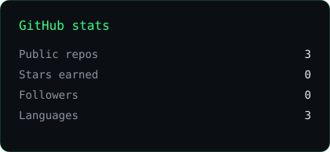
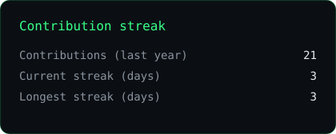
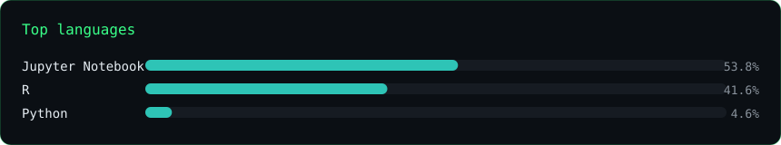
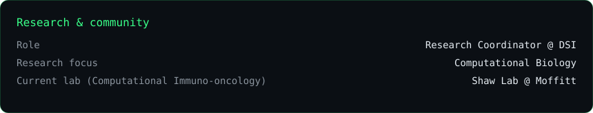

# Youssef Alhamzawi

`computational biology` · `immuno-oncology` · `machine learning` · `AI-driven drug development`

---

Computer Science & Mathematics student at the **University of Florida**, minoring in Philosophy.

I work where machine learning meets biology. My interests are computational biology, radiation immuno-oncology, and AI-driven drug development.

- **Research at Moffitt Cancer Center:** bioinformatics, statistical analysis, and machine learning on multi-omic immuno-oncology datasets.
- **Research Coordinator at DSI:** connecting 2,000+ members with UF labs and summer research programs.

---

  
  

  

  

  Stats and the hero structure regenerate weekly from <code>scripts/</code> via GitHub Actions.

